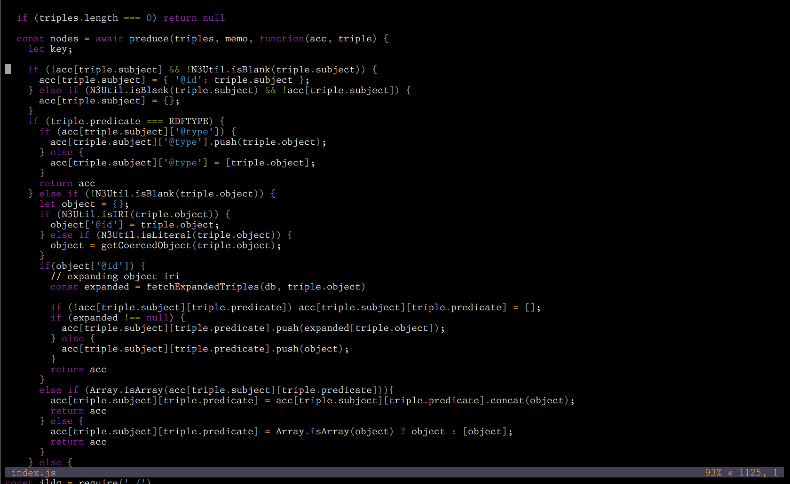

vis-importance-theme
====================

An opinionated javascript lexer and theme using it for the [vis](https://github.com/martanne/vis) editor.

Rationale
---------

My friend [Rebecca](https://twitter.com/rebeccaorg) has always set up themes in her editor of choice with I thought a very sensible approach to syntax highlighting. I could not share her work, since I've a vastly different preference in editors.

Instead of highlighting each different lexical class in a new color, yielding a pretty but distracting rainbow of color, instead optimize syntax highlighting to show things of special syntactic relevance.

Such things include:

- assignment differentiated from an equality comparison, in languages where both are allowed in expressions
- string closure, since ending delimiters are easy to omit when manipulating text
- keywords that are otherwise drawn from the same set of symbols as identifiers

Of special non-interest are most of the punctuation of programming: parentheses should fade into the background, leaving identifiers prominent. Comments must not be relegated to dim background players, but instead left brightly forward to explain the code they exist in. You may note that I have a certain fondness for literate programming, even if my own particular form of literate is the explanatory document, rather than code and text woven together.

Other than that I particularly like the colors purple and orange, so I used them in this theme.

Basis & License
---------------

This theme is based on [base16-vis by Petr Shevtsov](https://github.com/pshevtsov/base16-vis) and the [Spacemacs scheme by Nasser Alshammari](https://github.com/nashamri/spacemacs-theme)

It is [licensed](./LICENSE) under the MIT license.
